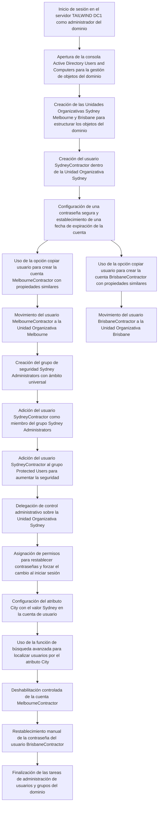

# Preparación

```mermaid
flowchart TD
    A[Inicio del proyecto de despliegue de una infraestructura de Active Directory en un entorno virtualizado controlado] --> B[Comprobación detallada de que el sistema anfitrión cumple los requisitos mínimos de hardware y software incluyendo versión del sistema operativo memoria RAM y compatibilidad con virtualización]
    B --> C[Instalación y habilitación completa del rol Hyper V en el sistema anfitrión para permitir la creación y administración de máquinas virtuales]
    C --> D[Configuración personalizada de las rutas de almacenamiento de máquinas virtuales y discos duros virtuales junto con la creación y configuración de un switch de red NAT para la comunicación interna]
    D --> E[Creación de la máquina virtual denominada TAILWIND DC1 destinada a funcionar como el primer controlador de dominio de la organización]
    E --> F[Instalación paso a paso del sistema operativo Windows Server 2022 en la máquina virtual del controlador de dominio utilizando una imagen ISO oficial]
    F --> G[Configuración manual y estática de los parámetros de red del controlador de dominio incluyendo dirección IP máscara de subred puerta de enlace y servidores DNS]
    G --> H[Instalación del rol Active Directory Domain Services junto con las características necesarias para la gestión del dominio]
    H --> I[Promoción del servidor a Controlador de Dominio mediante el asistente de configuración de Active Directory]
    I --> J[Creación del nuevo dominio tailwindtraders.internal como raíz de un nuevo bosque de Active Directory]
    J --> K[Reinicio completo del controlador de dominio para aplicar correctamente todas las configuraciones realizadas]

    K --> L[Creación de la máquina virtual TAILWIND MBR1 destinada a funcionar inicialmente como servidor miembro del dominio]
    L --> M[Instalación completa del sistema operativo Windows Server 2022 en el servidor miembro siguiendo el proceso estándar]
    M --> N[Configuración de red estática del servidor miembro asegurando que el servidor DNS principal apunte al controlador de dominio]
```

# Configuración de operaciones de controlador de dominio

```mermaid
flowchart TD
    A[Inicio de sesión en el servidor TAILWIND MBR1 utilizando credenciales de administrador del dominio] --> B[Instalación del rol Active Directory Domain Services en el servidor miembro para convertirlo en un controlador de dominio adicional]
    B --> C[Inicio del asistente de promoción del servidor a controlador de dominio]
    C --> D[Selección de la opción para agregar este servidor como controlador de dominio a un dominio existente]
    D --> E[Autenticación explícita de la cuenta de administrador del dominio para autorizar la promoción]
    E --> F[Configuración de las opciones del controlador de dominio incluyendo niveles funcionales servicios DNS y contraseña DSRM]
    F --> G[Finalización del proceso de instalación y reinicio automático del servidor]

    G --> H[Inicio de sesión posterior al reinicio utilizando la cuenta de administrador del dominio]
    H --> I[Apertura de la consola Active Directory Users and Computers para la administración del dominio]
    I --> J[Acceso a la sección de Operations Masters para la gestión de roles FSMO]
    J --> K[Transferencia controlada del rol RID Master desde el controlador de dominio original al nuevo controlador]
    K --> L[Confirmación correcta de la transferencia del rol y cierre de la consola]

    L --> M[Inicio de sesión en el servidor TAILWIND DC1 como administrador del dominio]
    M --> N[Apertura de la consola Active Directory Sites and Services para la gestión de la topología del dominio]
    N --> O[Creación de un nuevo sitio de Active Directory denominado Sydney para representar una ubicación geográfica]
    O --> P[Asociación del sitio Sydney al enlace de replicación DEFAULTIPSITELINK]
    P --> Q[Creación de una nueva subred IP con el prefijo 172.16.1.0 slash 24]
    Q --> R[Asociación de la subred creada al sitio Sydney para optimizar la replicación]
    R --> S[Finalización de la configuración de operaciones avanzadas del controlador de dominio]

```

# Configuración de operaciones de administración de usuarios

# Administrar directivas de contraseña

```mermaid
flowchart TD
    A[Inicio de sesión en el servidor TAILWIND DC1 como administrador del dominio] --> B[Apertura de la consola Group Policy Management para la administración de directivas]
    B --> C[Edición de la directiva Default Domain Policy aplicada a todo el dominio]
    C --> D[Navegación hasta la sección de directivas de contraseña del dominio]
    D --> E[Configuración de la longitud mínima de contraseña a catorce caracteres para todos los usuarios]
    E --> F[Cierre de la consola de administración de directivas de grupo]

    F --> G[Apertura de la herramienta Active Directory Administrative Center]
    G --> H[Navegación hasta el contenedor System y Password Settings Container]
    H --> I[Creación de una nueva directiva Fine Grained Password Policy]
    I --> J[Asignación del nombre Domain Admin Password Policy a la nueva directiva]
    J --> K[Configuración de la precedencia con valor uno para asegurar prioridad]
    K --> L[Configuración de la longitud mínima de contraseña a dieciséis caracteres]
    L --> M[Aplicación de la directiva específicamente al grupo Domain Admins]

    M --> N[Selección del dominio Tailwindtraders desde el panel principal]
    N --> O[Habilitación de la característica Active Directory Recycle Bin]
    O --> P[Confirmación de todas las advertencias y mensajes del sistema]
    P --> Q[Finalización de la administración avanzada de políticas de contraseña]

```

# Configuración de las opciones de seguridad

```mermaid
flowchart TD
    A[Inicio de sesión en el servidor TAILWIND DC1 como administrador del dominio] --> B[Apertura de la consola Group Policy Management para la administración de seguridad]

    B --> C[Edición de la directiva Default Domain Controller Policy]
    C --> D[Navegación hasta las opciones de seguridad locales del controlador de dominio]
    D --> E[Configuración de la directiva Restrict NTLM Authentication para aumentar la seguridad]
    E --> F[Establecimiento del valor Deny all para bloquear completamente NTLM]
    F --> G[Guardado de los cambios y cierre de la consola de directivas]

    G --> H[Creación de una nueva directiva de grupo denominada SydneyOUPolicy vinculada a la OU Sydney]
    H --> I[Edición detallada de la directiva SydneyOUPolicy]
    I --> J[Navegación hasta la configuración avanzada de auditoría de cuentas]
    J --> K[Habilitación de la auditoría de User Account Management]
    K --> L[Selección de eventos tanto de éxito como de error]
    L --> M[Cierre del editor de directivas de grupo]

    M --> N[Edición adicional de la directiva SydneyOUPolicy]
    N --> O[Navegación hasta la asignación de derechos de usuario]
    O --> P[Configuración de la opción Deny Log on as a service]
    P --> Q[Adición del grupo Sydney Administrators a la directiva]
    Q --> R[Confirmación de todos los cuadros de diálogo de seguridad]
    R --> S[Finalización completa de la configuración de seguridad del dominio]

```

