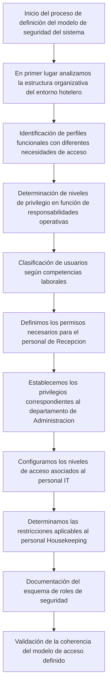
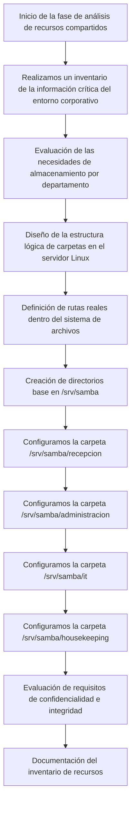
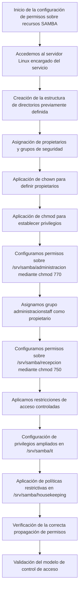
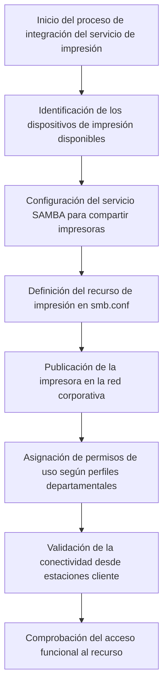
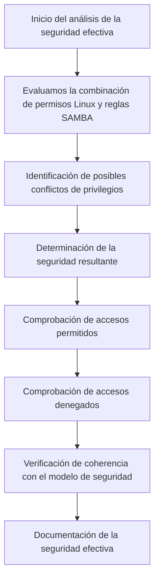
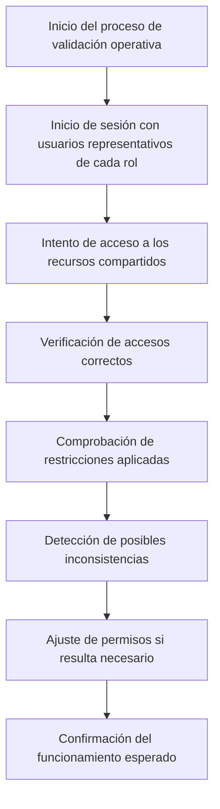
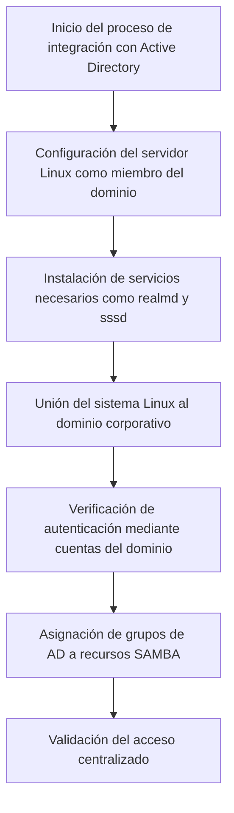
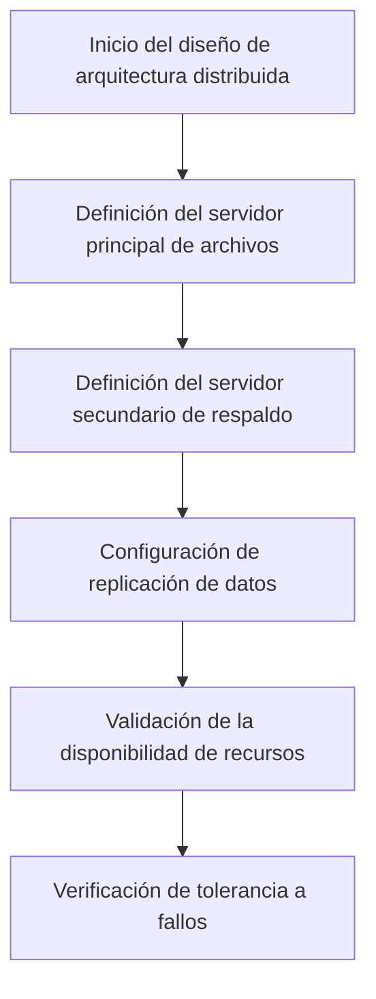

# Reto 0x: Gestionar los recursos compartidos SAMBA  

# Tarea 1: Clarificación de Roles de Seguridad (CE a)

```mermaid
flowchart TD
    A[Inicio del proceso de definición del modelo de seguridad del sistema] --> B[En primer lugar analizamos la estructura organizativa del entorno hotelero]
    B --> C[Identificación de perfiles funcionales con diferentes necesidades de acceso]
    C --> D[Determinación de niveles de privilegio en función de responsabilidades operativas]
    D --> E[Clasificación de usuarios según competencias laborales]

    E --> F[Definimos los permisos necesarios para el personal de Recepcion]
    F --> G[Establecemos los privilegios correspondientes al departamento de Administracion]
    G --> H[Configuramos los niveles de acceso asociados al personal IT]
    H --> I[Determinamos las restricciones aplicables al personal Housekeeping]

    I --> J[Documentación del esquema de roles de seguridad]
    J --> K[Validación de la coherencia del modelo de acceso definido]
```

---

# Tarea 2: Inventario y Planificación de Recursos (CE b)

```mermaid
flowchart TD
    A[Inicio de la fase de análisis de recursos compartidos] --> B[Realizamos un inventario de la información crítica del entorno corporativo]
    B --> C[Evaluación de las necesidades de almacenamiento por departamento]
    C --> D[Diseño de la estructura lógica de carpetas en el servidor Linux]

    D --> E[Definición de rutas reales dentro del sistema de archivos]
    E --> F[Creación de directorios base en /srv/samba]

    F --> G[Configuramos la carpeta /srv/samba/recepcion]
    G --> H[Configuramos la carpeta /srv/samba/administracion]
    H --> I[Configuramos la carpeta /srv/samba/it]
    I --> J[Configuramos la carpeta /srv/samba/housekeeping]

    J --> K[Evaluación de requisitos de confidencialidad e integridad]
    K --> L[Documentación del inventario de recursos]
```

---

# Tarea 3: Aplicación de Permisos de Carpeta (CE c)

```mermaid
flowchart TD
    A[Inicio de la configuración de permisos sobre recursos SAMBA] --> B[Accedemos al servidor Linux encargado del servicio]
    B --> C[Creación de la estructura de directorios previamente definida]
    C --> D[Asignación de propietarios y grupos de seguridad]

    D --> E[Aplicación de chown para definir propietarios]
    E --> F[Aplicación de chmod para establecer privilegios]

    F --> G[Configuramos permisos sobre /srv/samba/administracion mediante chmod 770]
    G --> H[Asignamos grupo administracionstaff como propietario]

    H --> I[Configuramos permisos sobre /srv/samba/recepcion mediante chmod 750]
    I --> J[Aplicamos restricciones de acceso controladas]

    J --> K[Configuración de privilegios ampliados en /srv/samba/it]
    K --> L[Aplicación de políticas restrictivas en /srv/samba/housekeeping]

    L --> M[Verificación de la correcta propagación de permisos]
    M --> N[Validación del modelo de control de acceso]
```

---

# Tarea 4: Despliegue del Servicio de Impresión (CE d)

```mermaid
flowchart TD
    A[Inicio del proceso de integración del servicio de impresión] --> B[Identificación de los dispositivos de impresión disponibles]
    B --> C[Configuración del servicio SAMBA para compartir impresoras]
    C --> D[Definición del recurso de impresión en smb.conf]

    D --> E[Publicación de la impresora en la red corporativa]
    E --> F[Asignación de permisos de uso según perfiles departamentales]

    F --> G[Validación de la conectividad desde estaciones cliente]
    G --> H[Comprobación del acceso funcional al recurso]
```

---

# Tarea 6: Determinación de la Seguridad Resultante (CE f)

```mermaid
flowchart TD
    A[Inicio del análisis de la seguridad efectiva] --> B[Evaluamos la combinación de permisos Linux y reglas SAMBA]
    B --> C[Identificación de posibles conflictos de privilegios]
    C --> D[Determinación de la seguridad resultante]

    D --> E[Comprobación de accesos permitidos]
    E --> F[Comprobación de accesos denegados]
    F --> G[Verificación de coherencia con el modelo de seguridad]

    G --> H[Documentación de la seguridad efectiva]
```

---

# Tarea 7: Validación de Acceso Funcional (CE g)

```mermaid
flowchart TD
    A[Inicio del proceso de validación operativa] --> B[Inicio de sesión con usuarios representativos de cada rol]
    B --> C[Intento de acceso a los recursos compartidos]

    C --> D[Verificación de accesos correctos]
    D --> E[Comprobación de restricciones aplicadas]
    E --> F[Detección de posibles inconsistencias]

    F --> G[Ajuste de permisos si resulta necesario]
    G --> H[Confirmación del funcionamiento esperado]
```

---

# Escenario Avanzado: Integración Linux – Active Directory

```mermaid
flowchart TD
    A[Inicio del proceso de integración con Active Directory] --> B[Configuración del servidor Linux como miembro del dominio]
    B --> C[Instalación de servicios necesarios como realmd y sssd]
    C --> D[Unión del sistema Linux al dominio corporativo]

    D --> E[Verificación de autenticación mediante cuentas del dominio]
    E --> F[Asignación de grupos de AD a recursos SAMBA]

    F --> G[Validación del acceso centralizado]
```

---

# Escenario Multi-Servidor

```mermaid
flowchart TD
    A[Inicio del diseño de arquitectura distribuida] --> B[Definición del servidor principal de archivos]
    B --> C[Definición del servidor secundario de respaldo]
    C --> D[Configuración de replicación de datos]

    D --> E[Validación de la disponibilidad de recursos]
    E --> F[Verificación de tolerancia a fallos]
```

