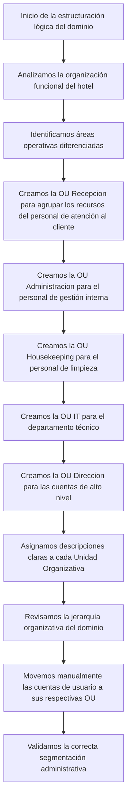
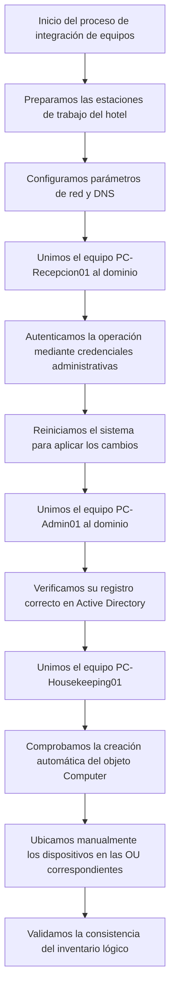
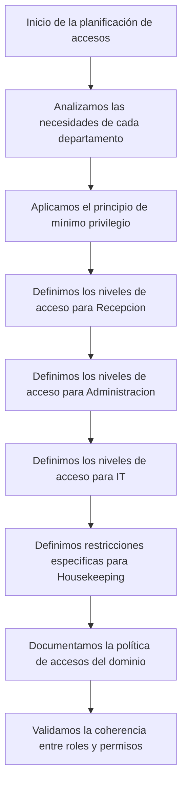
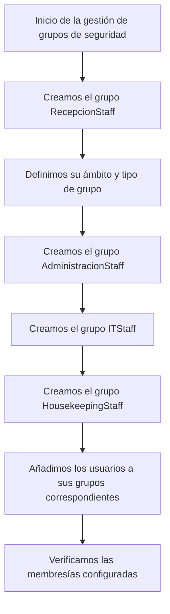
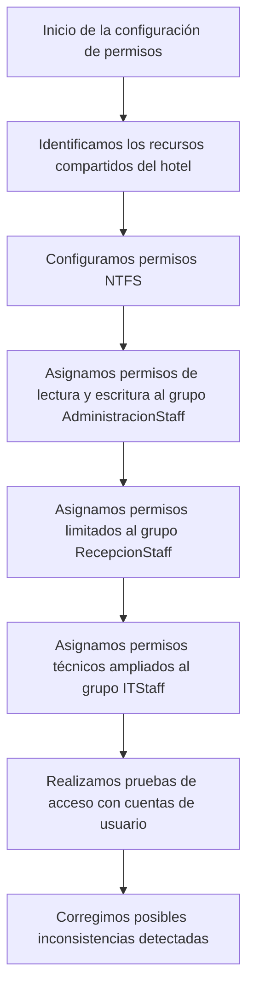
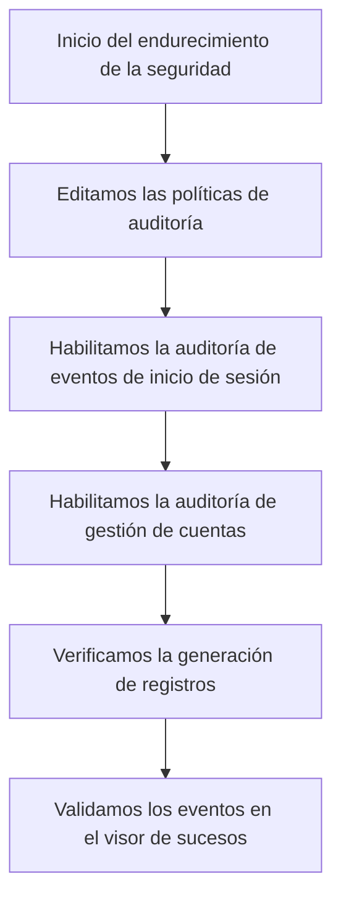
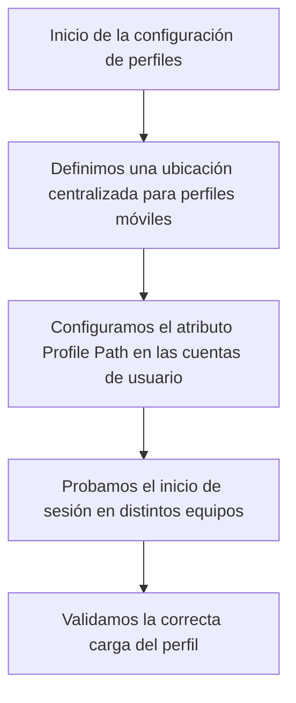
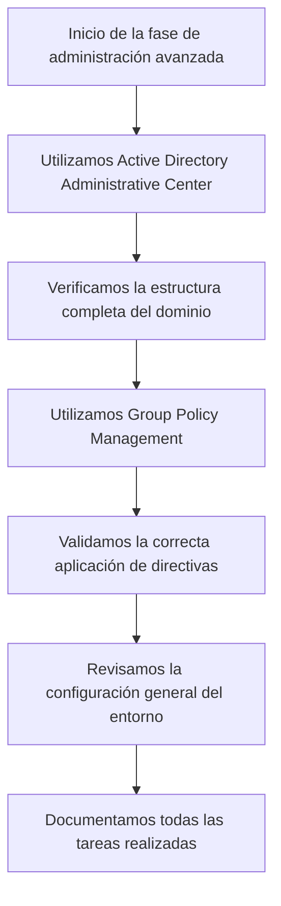

# Tarea 1: Creación de Cuentas Operativas (CE a)

```mermaid
flowchart TD
    A[Inicio de la fase de gestión de identidades del hotel] --> B[Analizamos los perfiles laborales necesarios para el funcionamiento del Hotel ValenCloud]
    B --> C[Identificamos los distintos roles operativos como recepción administración limpieza e IT]
    C --> D[Definimos una política de nomenclatura coherente para todas las cuentas de usuario]
    D --> E[He iniciado sesión en el controlador de dominio utilizando credenciales administrativas]
    E --> F[Abrimos la consola Active Directory Users and Computers]
    F --> G[Seleccionamos la Unidad Organizativa destinada a las cuentas operativas]

    G --> H[Creamos la cuenta Recepcion01 para el personal del front desk]
    H --> I[Asignamos una contraseña inicial segura cumpliendo los requisitos de complejidad]
    I --> J[Configuramos el cambio obligatorio de contraseña en el primer inicio de sesión]

    J --> K[Creamos la cuenta AdminHotel01 asociada al departamento administrativo]
    K --> L[Configuramos restricciones de acceso acordes a su función]

    L --> M[Creamos la cuenta Limpieza01 para el personal de housekeeping]
    M --> N[Limitamos los privilegios aplicando el principio de mínimo acceso]

    N --> O[Creamos la cuenta ITSupport01 destinada al soporte técnico]
    O --> P[Verificamos atributos como descripción departamento y nombre completo]

    P --> Q[Revisamos todas las cuentas creadas]
    Q --> R[Validamos que los objetos se han registrado correctamente en el dominio]
```

# Tarea 2: Definición de Entornos de Trabajo (CE b)

---

# Tarea 3: Registro de Dispositivos (CE c)

---

# Tarea 4: Diseño de la Estructura de Acceso (CE d)

---

# Tarea 5: Implementación de Grupos Funcionales (CE e)

---

# Tarea 6: Asignación de Permisos (CE f)

---

# Tarea 7: Auditoría de Seguridad Inicial (CE g)

---

# Tarea 8: Movilidad y Despliegue de Perfiles (CE h)

---

# Tarea 9: Aplicación de Herramientas de Administración (CE i)

# Tarea 2: Definición de Entornos de Trabajo (CE b)

---

# Tarea 3: Registro de Dispositivos (CE c)

---

# Tarea 4: Diseño de la Estructura de Acceso (CE d)

---

# Tarea 5: Implementación de Grupos Funcionales (CE e)

---

# Tarea 6: Asignación de Permisos (CE f)

---

# Tarea 7: Auditoría de Seguridad Inicial (CE g)

---

# Tarea 8: Movilidad y Despliegue de Perfiles (CE h)

---

# Tarea 9: Aplicación de Herramientas de Administración (CE i)

